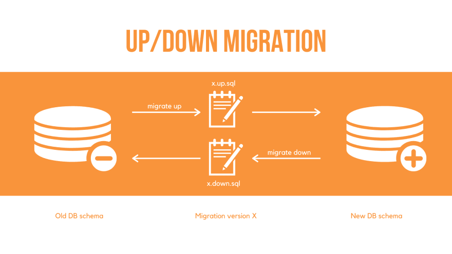

[Previous](./5-what-about-knex.md)

# Migrations

If you work with a database, you may want to have the same schema and data structure on every local developer and every cloud environment.

Therefore it's really good to have migrations which defines schema changes or allow to transform data which will be executed exactly once in the right order on every environment.

How migrations works in general:
* In the repository are files which contains of schema descriptions or simply SQL queries to setting up the database schema and transforming data
* Every file has a number which allows to define the order to execute all files, most times it's a UNIX timestamp as start of the filename
* In the database is a table tracking all already executed files
* A script which read the directory and match the list with the already executed files, run all new files and store them in the list

Some migration tools have the concept of `up` and `down`, so every migration file defines the changes needed to apply it and the changes needed to revert it. But these approach does have some disdvantages:
* If needs to be explicit tested. Otherwise it could happen the `down` function fails in the case it's needed
* It's double work to define both ways
* Not compatible changes can't be reverted without losing data (e.g. drop a column, the `down` function can readd the column, but the data are already lost or needs to be readded via backups or co.)

See also:

Other tools avoid this in favour of only going forward and if something was changed wrong, there will be added another change to make it right.

## Additional: Migrations for schema less databases

I often hear "schema less databases doesn't have a defined schema, so migrations are not needed".

But that's not totally true. Because the data has a schema, it's just not defined in the database. So if the schema of your data changes in your application, e.g. adding new fields, changing enum values, and so on there are two ways you can handle this:
* Change the schema in your application code and only new content will be in this schema. But this has a REALLY LARGE disadvantage. Your application code needs to know all schema changes and needs to work with all versions of your data. This can be the horror for long life systems!
* Alternatively you transform all existing data from the old to the new schema. And therefore migrations are perfect.

So yes, in my opinion every persistance layer, relation or schema less, needs migrations.

[Next](./7-transactions.md)
