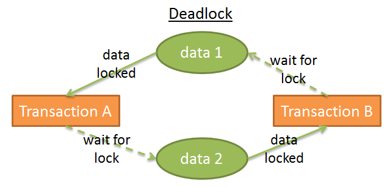

[Previous](./6-migrations.md)


# Transactions

Another important topic and advantage of relational databases are transactions.

In NoSQL databases every operation is atomar. A change is made or in case of a failure it's not made. So if you change in one operation multiple documents it's not possible half of them are changed and the other half not. But it could happen if you change a document in one operation and another document with another documentation you get inconsistent state if the second operation fails.

In relational databases operations are also atomar. With transactions you can extend this over multiple operations. Changing values in one table, changing values in another table, deleting rows which are not anymore needed, and so on and if one of these step run into a failure no change will be submitted. Only if every change is done successfully they will be submitted.

Example doing transactions with `pg`:

```javascript
try {
  // start new transaction
  client.query('BEGIN')

  // multiple operations
  client.query('...')
  client.query('...')
  client.query('...')

  // submit all changes after all operations are successfully done
  client.query('COMMIT')
} catch (e) {
  // rollback all changes if there is an error
  client.query('ROLLBACK')
}
```

This ensures you always have consistent data.

The tradeoff is performance, because the transactions are solved via locks. If multiple processes operate on the same data the first one locks the data, doing his changes and at the end with the submitting the lock is released. The second process needs to wait this time. In heavy write scenarios with lot of transaction usages this can be a bottleneck.

The more complex tradeoff are deadlocks. If process A locks data 1 needing locking data 2 afterwards during same time process B locks data 2 and needing locking data 1 both processes would be blocked by each other.

See also:


The good thing is PostgreSQL use row locks for most operations. So waiting time and deadlocks are more rare. Other databases like MySQL with ISAM locks always the complete table.


[Next](./8-adminer.md)
